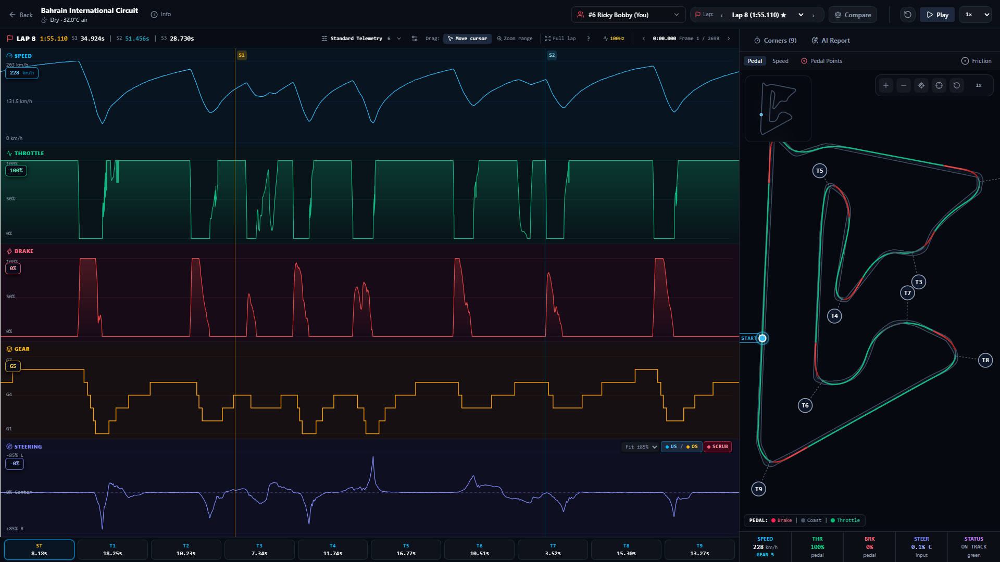
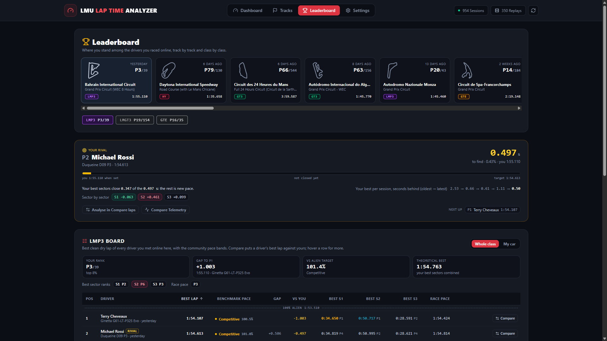
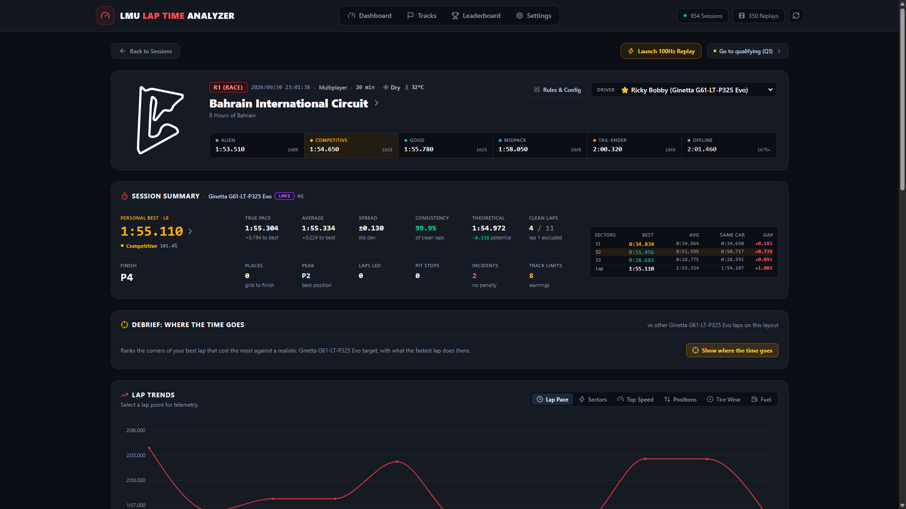
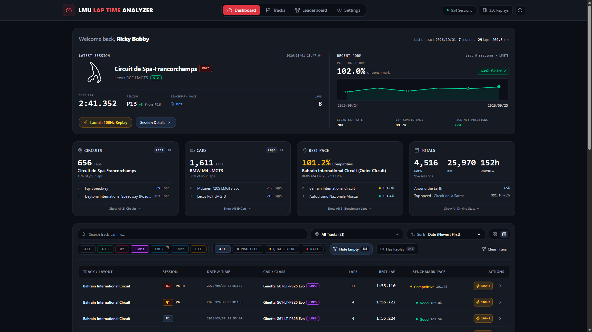

# 🏎️ Le Mans Ultimate Lap Time Analyzer

[](https://opensource.org/licenses/MIT)
[](https://www.typescriptlang.org/)
[](https://react.dev/)
[](https://vitejs.dev/)
[](https://sqlite.org/)
[](https://duckdb.org/)
[](https://vitest.dev/)

Telemetry analytics and lap comparison for **Le Mans Ultimate (LMU)**. It decodes LMU's own replays to get the telemetry of every car on track, not just yours, and puts your laps next to theirs.



---

## ✨ Highlights

### 🗺️ Replay & Telemetry Studio

- **100 Hz columnar DuckDB telemetry**: Ingests native telemetry at microsecond precision, smoothly interpolated across the start/finish timing loop.
- **2D track map with 1:1 boundaries**: Physical road edges and limit corridors for all 32 driven layouts in exact Cartesian coordinates ($x, z$), with color-coded speed, pedal zones, and live telemetry cursor.
- **Synchronized multi-channel traces**: Speed, lap delta, throttle & brake (with ABS/TC events), stepped gear changes, steering angle with real-time understeer/oversteer/scrub balance indicators, G-forces, dampers, tire temperatures & pressures, and Hypercar hybrid energy (SoC, Virtual Energy, Regen).
- **Three-phase corner breakdown**: Micro-splits deconstructing every turn into Entry (braking point, trail brake decay), Rotation (apex minimum speed, yaw rate), and Exit (throttle pick-up timing, traction).

### 🎬 Every Driver's Telemetry, from the Replays
- **Reverse-engineered replay format**: LMU's binary `.Vcr` replays (`gMb1.002f`) are decoded to extract the trajectory and telemetry of every car in the session: position, speed, throttle and brake (with ABS/TC), steering, gear and brake temperatures.
- **Your own laps at 100 Hz**: LMU's native DuckDB telemetry is read and fused with the replay trajectory, cut cleanly at the timing line.
- **Compare against anyone**: any of your laps against any other driver's lap from the same layout, aligned on track position: speed and delta traces, pedals, racing lines on the map, sector and corner gaps.
- **Built for big files**: replays of several hundred MB are decoded in worker threads and cached, so the next look is instant.

### 🏆 Leaderboard & Rivals

- **Leaderboard per layout and class**: Ranks the real drivers you met online on each layout on their representative dry laps, compared against official alien targets.
- **A dynamic rival to chase**: Automatically picks a competitive rival about 0.3 s ahead (or a ghost target) until you beat them, showing exactly where the time is won or lost corner by corner.
- **Community benchmark integration**: Synchronizes target lap times directly from community reference sheets with automated diff and patch-level tracking.

### 🏎️ Dashboard & Sessions

- **True Pace & Consistency**: Calculates true pace (top 3 clean laps average), theoretical best, and lap consistency score exclusively from clean flying laps (out, in, and start laps filtered out).
- **Multiclass race analysis**: Full classification standings, position deltas, sector splits vs best same car, tire wear degradation profiles, and stewards penalty logs.
- **Multi-session progression**: Interactive pace trajectory tracking performance evolution across stints, cars, and layouts.



### 🎯 Coaching
- **Corner analysis**: entry (braking, trail brake), rotation (apex speed) and exit (throttle pick-up) for every turn, with consistency scoring.
- **Deterministic coaching**: driving deficits ranked by time lost, repeatability and confidence (`priority = timeLoss * repeatability * confidence`).
- **AI Race Engineer** (optional, Google Gemini): explains the findings and suggests setup changes.

### 🔌 Plug & Play
- Finds the LMU Steam install, results, replays and telemetry on its own; handles long multi-stint sessions and multi-file telemetry.

---

## 🛠️ Documentation

- [`docs/TELEMETRY_FORMAT.md`](docs/TELEMETRY_FORMAT.md): LMU 100 Hz DuckDB telemetry tables and channels.
- [`docs/VCR_FORMAT.md`](docs/VCR_FORMAT.md) / [`docs/VCR_ANALYSIS.md`](docs/VCR_ANALYSIS.md): the reverse-engineered binary replay format (`gMb1.002f`) and its accuracy.
- [`docs/XML_FORMAT.md`](docs/XML_FORMAT.md): LMU results XML schema.
- [`docs/LMU_REST_API.md`](docs/LMU_REST_API.md): LMU's embedded REST API (`:6397`).

---

## 🚀 Quick Start

### Prerequisites
- [Node.js](https://nodejs.org/) (v18.0 or newer)
- [Le Mans Ultimate](https://lemansultimate.com/) installed on your PC
- *(Optional)* Google Gemini API key for AI Race Engineer post-stint debriefs

### Installation

1. **Clone the repository**:
   ```bash
   git clone https://github.com/hockeylagu/LMULapTime.git
   cd LMULapTime
   ```

2. **Install dependencies**:
   ```bash
   npm install
   ```

3. **Configure Environment (Optional)**:
   Create a `.env` file in the project root if you want to enable Gemini AI coaching debriefs:
   ```env
   GEMINI_API_KEY=your_gemini_api_key_here
   ```

4. **Launch the application**:
   ```bash
   npm run dev
   ```
   *Windows users can also simply double-click `launch.bat`.*

5. **Open your browser**:
   - Frontend UI: [http://localhost:5173](http://localhost:5173)
   - Backend API: [http://localhost:3001](http://localhost:3001)

---

## ⚙️ Configuration & Directory Settings

By default, the application automatically detects standard Steam installation paths:
- **Session Results XML**: `C:\Program Files (x86)\Steam\steamapps\common\Le Mans Ultimate\UserData\LOG\Results`
- **Replays Directory**: `C:\Program Files (x86)\Steam\steamapps\common\Le Mans Ultimate\UserData\Replays`
- **Telemetry DuckDB Directory**: `C:\Program Files (x86)\Steam\steamapps\common\Le Mans Ultimate\UserData\Telemetry`

To adjust your paths or driver profile:
1. Click **Settings** in the top navigation bar.
2. Enter your custom results, replays, or telemetry directories (live status badges verify that each directory exists).
3. Set your **In-Game Driver Profile Name** to automatically prioritize your laps.
4. Click **Rescan & Load Telemetry**.

---

## 🧪 Available Scripts

| Command | Description |
| :--- | :--- |
| `npm run dev` | Starts frontend (Vite) and backend (Express) concurrently with hot-reload. |
| `npm run dev:server` | Starts the backend server using `tsx watch`. |
| `npm run dev:client` | Starts the Vite development server. |
| `npm run build` | Validates TypeScript types and compiles the production client bundle. |
| `npm test` | Runs the Vitest suite (1,700+ tests across 200+ files). |
| `npm run test:watch` | Runs Vitest in interactive watch mode. |
| `npm run test:coverage` | Runs the test suite and generates V8 code coverage reports. |
| `npm run telemetry:probe` | Probes live memory-mapped telemetry structures via .NET 8 tool. |
| `npm run telemetry:record`| Records live session telemetry to disk via .NET 8 tool. |
| `npm run vcr:correlate` | Runs offline correlation between XML results and binary replay streams. |
| `npm run vehicles:catalog` | Rebuilds the vehicle catalog. |

---

## 🛠️ Tech Stack

- **Frontend**: [React 19](https://react.dev/), [TypeScript](https://www.typescriptlang.org/), [Vite 8](https://vitejs.dev/), [Tailwind CSS v4](https://tailwindcss.com/), [Recharts](https://recharts.org/), [Lucide React](https://lucide.dev/)
- **Backend**: [Node.js](https://nodejs.org/), [Express 5](https://expressjs.com/), [Better-SQLite3](https://github.com/WiseLibs/better-sqlite3) (WAL Mode), [DuckDB](https://duckdb.org/), [Fast-XML-Parser](https://github.com/NaturalIntelligence/fast-xml-parser), [@google/genai](https://github.com/googleapis/genai-js)
- **Diagnostics & Tooling**: C# .NET 8 Telemetry Recorder, TSX analysis scripts
- **Test Suite**: [Vitest](https://vitest.dev/), Testing Library, JSDOM

---

## 📄 License

Distributed under the **MIT License**. See [`LICENSE`](LICENSE) for more details.

---

## 🤝 Contributing

Contributions, feedback, and feature suggestions are welcome! Feel free to open an issue or submit a pull request.
