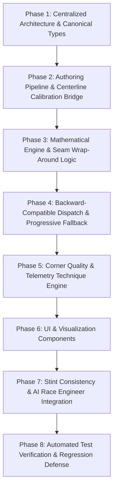

# 🏎️ Canonical Track Corners & Unified Complex Analysis — Implementation Plan

> **Document Status**: Draft / Pre-Implementation Planning & Architecture Refactoring  
> **Primary Objective**: Refactor and definitively establish **"What is a Corner?"** using authoritative motorsport engineering specifications, and **centralize circuit specifications, track geometry, and corner definitions** into a single authoritative Track Architecture.  
> **Target Subsystems**: `src/utils/cornerAnalysis.ts`, `src/utils/circuitSpecs.ts`, `src/utils/canonicalTracks/`, `server/data/tracks/`, `src/components/replay/`  
> **Key References**: [TURN_TIME_DELTA_CALCULATION.md](file:///c:/Documents/LMULapTime/docs/TURN_TIME_DELTA_CALCULATION.md), [TRACK_BOUNDARIES_PIPELINE.md](file:///c:/Documents/LMULapTime/docs/TRACK_BOUNDARIES_PIPELINE.md), [circuitSpecs.ts](file:///c:/Documents/LMULapTime/src/utils/circuitSpecs.ts)

---

## 1. Context & Architectural Motivation

### 1.1 The Fundamental Flaw of Dynamic Speed-Dip Discovery
The legacy implementation in `cornerAnalysis.ts` attempted to discover corners heuristically by scanning telemetry for speed dips ($\ge 6\text{ km/h}$) and steering reversals. This created four catastrophic flaws:
1. **Odometer Drift vs. Centerline Station**:
   - Driving lines vary between drivers. Calculating deltas across driven odometer distance (`distM`) drifts across laps, comparing cars at different physical track locations. This caused Daytona Turn 4 to falsely report `+0.72s` loss when the real delta at the exit gate was `+0.614s` ([TURN_TIME_DELTA_CALCULATION.md](file:///c:/Documents/LMULapTime/docs/TURN_TIME_DELTA_CALCULATION.md)).
2. **Skipped Kinks & Cascade Turn Renumbering**:
   - Flat-out kinks (Daytona T4, Spa Blanchimont T17, Monza Curva Grande T3) have speed dips $< 6\text{ km/h}$. The algorithm dropped them, shifting all subsequent corner numbers down by one across the entire lap.
3. **Flawed Multi-Lap Stint Consistency**:
   - `useCornerConsistency.ts` extracted corner boundaries from the currently selected lap. An early brake or lockup on that lap contaminated the spatial gates for every other lap in the stint.
4. **Contradictory Coaching on Linked Complexes (Chicanes & Esses)**:
   - Treating Monza's *Variante del Rettifilo* as independent "Turn 1" and "Turn 2" generated erroneous driver coaching. Over-speeding Turn 1 entry looked "green", but ruined Turn 2 exit, costing massive lap time down Curva Grande. Chicanes and esses must be analyzed as **unified physical complexes**.

### 1.2 The Solution: Canonical Ground-Truth Sourcing & Centralization
- **Tracks do not move in time**. Physical corners, kerbs, banking, and FIA timing gates are immutable.
- Corner definitions, timing gates, and circuit specifications must be authored from **credible, authoritative motorsport sources** (FIA Homologations, ACO Circuit Maps, IMSA Timing Manuals).
- All track-related data must be **centralized into a single authoritative Track Registry** per `layoutKey`, eliminating parallel maintenance of lengths, turn counts, and corner names.

---

## 2. Definitive Architecture: What is a Corner?

In professional race engineering (MoTeC i2 Pro, Bosch WinDARAB, Cosworth Toolset), a corner is not merely a single minimum speed point. It is a **multi-dimensional physical system** consisting of spatial gates, geometric profiles, 3D topography, kerb interactions, racing line philosophies, and strategic lap-time weights.

```
       [Pre-Braking Gate]
              │
              ▼  (Approach Speed Trap)
       ┌──────────────┐
       │   Straight   │
       └──────────────┘
              │
              ▼  (entryStationM: Initial Deceleration Gate)
    ┌────────────────────┐
    │ Straight Braking   │  <-- Brake Pressure Rise Rate (%/ms), Longitudinal Decel (Gx)
    └────────────────────┘
              │
              ▼  (Turn-In Gate / Initial Steering Angle > 2°)
    ┌────────────────────┐
    │   Trail-Braking    │  <-- Traction Circle G-G Trade-off, Brake Bleed-off, Steering Scrub
    └────────────────────┘
              │
              ▼  (apexStationM: Physical Curb Clipping Point / Minimum Speed Window)
    ┌────────────────────┐
    │     Apex Zone      │  <-- Min Speed Location (Early vs Late), Kerb Strike / Platform Stability
    └────────────────────┘
              │  (For chicanes/esses: Direction Transition & Steering Reversal Rate)
              ▼  (Throttle Pickup Gate: Initial Power Application)
    ┌────────────────────┐
    │ Traction / Exit    │  <-- Throttle Ramp Rate (%/s), Hesitation / Double-Dip, Oversteer Yaw
    └────────────────────┘
              │
              ▼  (exitStationM: Vehicle Straightened / Track-Out Kerb Termination)
    ┌────────────────────┐
    │ Following Straight │  <-- Downstream Speed Trap / Exit Speed Carried
    └────────────────────┘
```

---

### 2.1 The Complete Multi-Dimensional Corner Schema

Below is the complete TypeScript domain model in `src/utils/canonicalTracks/types.ts`:

```typescript
/** High-level segment classification */
export type CanonicalSegmentType =
  | 'single_corner'       // Standard isolated corner (e.g. Monza Parabolica)
  | 'chicane'             // Linked tight direction reversal (e.g. Monza Rettifilo, Spa Bus Stop)
  | 'esses'               // Flowing multi-apex sequence (e.g. Silverstone Maggotts-Becketts, COTA T2-T9)
  | 'hairpin'             // High heading change low-speed stop (e.g. Spa La Source)
  | 'carousel'            // Constant/long-duration sustained lateral G turn (e.g. Nurburgring Karussell)
  | 'kink_flat';          // High-speed slight direction change (e.g. Daytona T4, Blanchimont T17)

/** Strategic priority of the turn regarding lap time sensitivity */
export type StrategicPriority =
  | 'exit_critical'       // Leads onto long straight (e.g. Tertre Rouge, Parabolica) -> +1 km/h = +0.2s
  | 'heavy_braking'       // High-speed approach into tight stop (e.g. Monza T1, Spa T1) -> Stopping power
  | 'commitment_sweeper'  // Aerodynamic downforce & scrub sensitive (e.g. Spa Pouhon, Silverstone Copse)
  | 'sacrifice'           // First element of complex; apex speed intentionally sacrificed for next apex
  | 'technical_infield';   // Flow, weight transfer, and rhythm

/** Geometric curvature progression across the turn */
export type RadiusProfile =
  | 'constant'            // Fixed radius circular arc
  | 'tightening'          // Decreasing radius on entry/mid (requires patient trail-brake, late apex)
  | 'opening'             // Increasing radius on exit (allows early throttle pickup & progressive track-out)
  | 'compound';           // Multi-radius complex

/** Topographical vertical elevation profile */
export type ElevationProfile =
  | 'flat'
  | 'uphill'              // Natural deceleration; allows later braking (e.g. COTA T1, Red Bull Ring T3)
  | 'downhill'            // Extends braking distance, front locking risk (e.g. Laguna Seca Corkscrew)
  | 'crest'               // Vehicle unweights over apex; loss of aero downforce & traction
  | 'compression_dip';    // Increased downforce & grip due to vertical compression (e.g. Eau Rouge)

/** Transverse track banking / camber */
export type CamberProfile =
  | 'positive_banked'     // Positive banking into the turn (Daytona 31°, Zandvoort) -> high grip
  | 'flat_neutral'        // Level surface
  | 'off_camber'          // Slopes away from the turn (Spa Bruxelles, Bahrain T10) -> severe understeer risk
  | 'transitional';       // Camber changes mid-corner

/** Kerb mountability and tactical behavior */
export type KerbBehavior =
  | 'ride_kerb'           // Low/flat kerb; aggressive riding is required for optimal lap time
  | 'clip_kerb'           // Light tire touch only; riding too deep upsets aero/chassis
  | 'avoid_kerb'          // Tall sausage/turtle kerb; causes launch, damage, or penalty
  | 'none';               // Flat white line or gravel boundary

/** Racing line geometry recommended for this turn */
export type RacingLinePhilosophy =
  | 'geometric_arc'       // Symmetrical entry/exit arc to maximize rolling minimum speed
  | 'late_apex'           // Square off entry to straighten exit onto straight
  | 'v_shape'             // Hard point-and-squirt stop, rotate on brakes, straight acceleration
  | 'double_apex'         // Clip two apexes with slight mid-corner drift
  | 'straightline_curbs'; // Cut straight across kerbs in a chicane

/** Sub-apex definition within single corners, chicanes, and esses */
export interface CanonicalSubApex {
  turnNumber: number;            // Official turn number (e.g. 1 in T1-T2)
  subId: string;                 // Machine slug, e.g. "monza_rettifilo_a1"
  name: string;                  // e.g. "Prima Variante (Apex 1 - Right)"
  turnDirection: 'left' | 'right';
  
  // Physical Spatial Location
  apexStationM: number;          // Exact track centerline station (m)
  apexCoordinate: [number, number]; // [x, z] in LMU local world space (meters)
  
  // Functional Role
  role: 'entry_apex' | 'transition_apex' | 'exit_apex' | 'sacrificial_apex';
  nominalGear: {
    hypercar: number;
    gt3: number;
  };
  targetMinSpeedKmh: {
    hypercar: number;
    gt3: number;
  };
  kerbProfile: KerbBehavior;
  nominalHeadingDeg: number;     // Car orientation at apex clipping point
}

/** Complete Canonical Definition of a Track Turn or Complex */
export interface CanonicalTurnDefinition {
  // 1. Identity & Homologation
  id: string;                    // Machine ID: e.g. "monza_gp_t1_t2"
  cornerNumber: number;          // Numeric primary key (e.g. 1) for backward compatibility
  displayNumber: string;         // Display string: e.g. "T1-T2", "T4", "T8-T10"
  officialName: string;          // FIA/ACO official name: e.g. "Variante del Rettifilo"
  vernacularName?: string;       // Historical/common name: e.g. "First Chicane"
  turnNumbers: number[];         // Turns included: [1, 2]
  sourceReference: string;       // Citation: e.g. "FIA Circuit Homologation ITA-2024 / Grade 1"
  
  // 2. Classification & Strategy
  type: CanonicalSegmentType;
  strategicPriority: StrategicPriority;
  racingLinePhilosophy: RacingLinePhilosophy;
  turnDirection: 'left' | 'right' | 'left_right' | 'right_left' | 'complex';
  
  // 3. Physical Spatial Gates (Centerline Station s in [0, lengthM])
  approachStationM: number;      // Pre-braking telemetry reference gate (e.g. 150m before braking)
  entryStationM: number;         // Primary entry gate (nominal start of deceleration)
  exitStationM: number;          // Primary exit gate (car straightened, back to 100% throttle)
  downstreamSpeedTrapM: number;  // Distance down following straight to verify exit speed retention
  crossesStartFinish?: boolean;  // True if entryStationM > exitStationM (e.g. Daytona T12)
  lengthM: number;               // Physical footprint: exitStationM - entryStationM (modulo L)
  
  // 4. Geometry & Curvature Profile
  radiusProfile: RadiusProfile;
  nominalRadiusM: number;        // Curve radius at tightest point
  totalHeadingChangeDeg: number; // Angular heading rotation across the turn
  
  // 5. Topography & Surface
  elevationProfile: ElevationProfile;
  elevationDeltaM: number;       // Vertical climb/drop (meters) across turn
  camberProfile: CamberProfile;
  camberDeg: number;             // Approximate cross-slope banking angle (degrees)
  bumpinessIndex: 1 | 2 | 3 | 4 | 5; // 1 = billiard smooth, 5 = Sebring concrete seams
  
  // 6. Kerb & Boundary Interactions
  entryKerb: { present: boolean; side: 'left' | 'right' | 'none'; behavior: KerbBehavior };
  apexKerb: { behavior: KerbBehavior; heightDescription?: string };
  exitKerb: { behavior: KerbBehavior; runoffType: 'asphalt' | 'gravel' | 'grass' | 'wall' };
  
  // 7. Sub-Apexes (1 for single turn, 2 for chicane, 3+ for esses)
  subApexes: CanonicalSubApex[];
  
  // 8. Complex-Specific Dynamics (for chicanes & esses)
  complexDynamics?: {
    nominalTransitionDistM: number;     // Physical distance between sub-apexes
    transitionDirection: 'left_to_right' | 'right_to_left' | 'continuous';
    chassisReversalDemand: 'extreme_flick' | 'flowing' | 'delayed_weight_transfer';
    compromiseRatioDescription?: string; // Guidance on how much Apex 1 must be compromised for Apex 2
  };
}
```

---

## 3. Centralized Track & Circuit Architecture (Single Source of Truth)

### 3.1 Resolving Current Fragmentation
Currently, track data is fragmented across 4 disparate files:
* `src/utils/circuitSpecs.ts` holds metadata (`turnCount`, `officialLengthMeters`, `famousCorners`).
* `server/data/tracks/*.json` & `public/tracks/*.json` hold 2D boundary polygons, survey scale, and timing gates.
* `server/data/tracks/index.json` holds an index of timing gates.
* `src/utils/trackLayout.ts` holds layout name resolution.

This fragmentation caused discrepancies (e.g. Monza length 5793m in `circuitSpecs.ts` vs 5792.7m in `monza_gp.json`; `famousCorners` maintained as a disconnected text list).

### 3.2 The Unified Track Specification Contract
We unify these into a **single authoritative track architecture** per `layoutKey`:

```typescript
export interface TimingGateDefinition {
  name: string;
  stationM: number;
  center: [number, number];
  left: [number, number];
  right: [number, number];
}

export interface UnifiedTrackSpecification {
  // 1. Identity & Classification (from circuitSpecs)
  layoutKey: string;             // Primary key: "monza_gp", "daytona_road_course"
  circuitId: string;             // "monza", "daytona"
  layoutId: string;              // "gp", "road_course"
  officialName: string;          // "Autodromo Nazionale Monza"
  layoutName: string;            // "Grand Prix Circuit"
  country: string;
  countryCode: string;
  flagEmoji: string;
  city: string;
  fiaGrade?: string;
  openedYear?: number;
  
  // 2. Physical & Metric Geometry (from survey models)
  lengthM: number;               // Immutable centerline length (e.g. 5792.7)
  direction: 'Clockwise' | 'Counter-Clockwise';
  elevationChangeMeters?: number;
  officialTurnCount: number;     // e.g. 11
  sourceReference: string;       // Primary homologation citation
  boundarySource: 'TUM-survey' | 'Track-Atlas' | 'OpenStreetMap' | 'Hybrid' | 'Telemetry-Corridor';
  
  // 3. Timing Gates
  timingGates: {
    startFinish: TimingGateDefinition;
    sector1: TimingGateDefinition;
    sector2: TimingGateDefinition;
  };
  
  // 4. Canonical Corners & Complexes (Exhaustive Definitions)
  turns: CanonicalTurnDefinition[];
}
```

### 3.3 Payload Optimization: Dual-Tier Track Packaging
To maintain instantaneous client navigation with zero bundle bloat:
1. **Tier 1: Synchronous Metadata & Turn Registry (`src/utils/canonicalTracks/registry.ts`)**:
   - Contains all `UnifiedTrackSpecification` objects **excluding heavy polyline points**.
   - Weighs $< 45\text{ KB}$ for all 21 tracks combined.
   - Bundled directly into the app; synchronously available for `TelemetryCornerStrip`, consistency calculations, and timing tables without network delay.
2. **Tier 2: Asynchronous Boundary Polylines (`public/tracks/{layoutKey}.json`)**:
   - Contains the heavy 2D boundary polygons (`centerline`, `leftBoundary`, `rightBoundary`, $100\text{–}600\text{ KB}$ per track).
   - Lazy-loaded on-demand via fetch only when the GPS Track Map is opened.

### 3.4 Facade Pattern for `circuitSpecs.ts`
To ensure **zero breaking changes** across existing components:
- `getCircuitSpecification(layoutKey)` in `src/utils/circuitSpecs.ts` becomes a thin facade reading directly from `registry.ts`.
- `famousCorners` is dynamically generated from `turns.map(t => `${t.officialName} (${t.displayNumber})`)`, guaranteeing that names and turn numbers are always in 100% synchronization.

---

## 4. How Corner Quality Will Be Evaluated (Based on Definition)

Once the canonical physical definition of a turn is established, the evaluation engine evaluates **Corner Driving Quality** against objective physics rather than fuzzy heuristics:

| Analysis Phase | Evaluated Metric | Definition Ground-Truth Reference | Technique Deficit Flagged |
|---|---|---|---|
| **Approach & Braking** | **Brake Hit Rate** ($\%/\text{ms}$) | `entryStationM`, `approachStationM` | Soft, hesitant initial brake pressure application |
| | **Braking Point Delta** ($\Delta\text{m}$) | `entryStationM` | Braking too early (conceding time) vs overshooting |
| | **Trail-Brake Shape** | `subApex.apexStationM`, `radiusProfile` | Releasing brake abruptly instead of smooth friction-circle decay into apex |
| **Turn-In & Rotation** | **Turn-In Point** ($\Delta\text{m}$) | `entryStationM`, `nominalRadiusM` | Turning in too early (pinching apex) vs late |
| | **Steering Scrub Angle** ($^\circ$) | `nominalRadiusM`, `camberProfile` | Over-steering beyond peak slip angle; front tire scrub |
| | **Yaw Rate Lag** ($\text{sec}$) | `elevationProfile`, `camberProfile` | Chassis not rotating to match nominal corner heading |
| **Apex Dynamics** | **Min Speed Location** ($\Delta s$) | `subApex.apexStationM` | **Early Apex**: Reached min speed 15m before apex (parked on entry)<br>**Blown Apex**: Min speed after apex (overshot) |
| | **Apex Minimum Speed** ($\text{km/h}$) | `subApex.targetMinSpeedKmh` | Under-speeding mid-corner rolling momentum |
| | **Kerb Utilization** | `subApex.kerbProfile` | Failing to ride mountable kerb vs harsh strike on sausage kerb |
| **Complex Direction Change** | **Steering Reversal Rate** ($^\circ/\text{s}$) | `complexDynamics.nominalTransitionDistM` | Slow steering roll rate during chicane weight transfer |
| | **Weight Transfer Lag** ($\text{sec}$) | `complexDynamics.chassisReversalDemand` | Turning before suspension settles; inducing snap-oversteer |
| **Throttle & Exit** | **Throttle Pickup Gate** ($\Delta\text{m}$) | `subApex.apexStationM`, `radiusProfile` | Delaying initial throttle application |
| | **Throttle Hesitation ("Double-Dip")** | `strategicPriority`, `radiusProfile` | Lifting off throttle mid-acceleration due to rear slide or understeer |
| | **Exit Road Width Utilization** | `exitKerb.runoffType` | Leaving 1.5m unused track on exit; failing to run to the exit kerb |
| **Straight Retention** | **Downstream Delta** ($\Delta t$) | `downstreamSpeedTrapM`, `strategicPriority` | Losing 0.3s down the straight because exit speed was down by 3 km/h |

---

## 5. Phased Implementation Roadmap



---

### Phase 1: Centralized Architecture & Canonical Types
- [ ] **1.1 Establish Domain Types (`src/utils/canonicalTracks/types.ts`)**:
  - Implement `CanonicalTurnDefinition`, `CanonicalSubApex`, and `UnifiedTrackSpecification`.
  - Implement supporting enums (`StrategicPriority`, `RadiusProfile`, `ElevationProfile`, `CamberProfile`, `KerbBehavior`, `RacingLinePhilosophy`).
- [ ] **1.2 Centralized Track Registry (`src/utils/canonicalTracks/registry.ts`)**:
  - Centralize `circuitSpecs.ts` metadata and timing gates into the unified track registry.
- [ ] **1.3 Backwards-Compatible Extensions (`src/utils/cornerAnalysis.ts` & `circuitSpecs.ts`)**:
  - Keep `cornerNumber: number` as the numeric key across all comparison interfaces.
  - Refactor `circuitSpecs.ts` to query `registry.ts` as a transparent facade.

---

### Phase 2: Authoring Pipeline & Pilot Circuits
- [ ] **2.1 Authoring Methodology**:
  1. Load survey centerline $(x, z, s)$ from `server/data/tracks/{layoutKey}.json`.
  2. Inspect official FIA/ACO homologation map:
     - Identify apex curb geometry, turn direction, approach markers, and exit curbs.
  3. Map the physical curb apex to the corresponding centerline station $s_{\text{apex}}$.
  4. Author all physical metadata (elevation profile, camber, strategic priority, kerb behavior).
- [ ] **2.2 Schema Linter & Validator (`test/utils/canonicalTrackLint.test.ts`)**:
  - Enforce monotonic ordering: $s_0 < s_1 < \dots < L$.
  - Enforce sub-apex containment: $s_{\text{entry}} < s_{\text{apex}} < s_{\text{exit}}$ (modulo $L$).
  - Enforce turn count matches `officialTurnCount`.
  - Enforce valid `sourceReference` string for every circuit.
- [ ] **2.3 Author Core Wave 1 Pilot Circuits (`src/utils/canonicalTracks/definitions/`)**:
  - `daytona_road_course.ts` (12 turns: T1-T2 Infield, T8-T10 Bus Stop, T12 S/F wrap-around)
  - `monza_gp.ts` (11 turns: T1-T2 Rettifilo, T4-T5 Roggia, T8-T10 Ascari, T11 Parabolica)
  - `spa_gp.ts` (19 turns: T2-T4 Eau Rouge/Raidillon, T5-T7 Les Combes, T10-T11 Pouhon, T18-T19 Bus Stop)
  - `sarthe_full.ts` (33 turns: T1-T3 Dunlop, T7-T12 Chicanes Forza/Michelin, T17-T23 Porsche Curves)
  - `sebring_full.ts` (17 turns: T1 Hairpin, T7 Hairpin, T15-T16 Tower, T17 Sunset Bend)

---

### Phase 3: Mathematical Engine & Start/Finish Seam Unwrap
- [ ] **3.1 Exact Centerline Station Projection**:
  - Project telemetry coordinates $(x, z)$ onto centerline station $s \in [0, L]$ via orthogonal distance minimization with zero odometer drift.
- [ ] **3.2 Start/Finish Seam Wrap-Around Logic ($s_{\text{entry}} > s_{\text{exit}}$)**:
  - For corners crossing the S/F line (e.g. Daytona T12):
    - Spatial query: `s >= entryStationM || s <= exitStationM`.
    - Elapsed duration: $\text{Duration} = (t_{\text{lap}} - t(s_{\text{entry}})) + t(s_{\text{exit}})$.
- [ ] **3.3 Contiguous Straight Synthesis (Lap Closure Invariant)**:
  - Automatically synthesize `StraightSegmentComparison` in all gaps between canonical turns.
  - Invariant: $\sum \Delta t_{\text{segments}} \equiv \Delta t_{\text{lap}}$.
- [ ] **3.4 Exact Scrubber Parity**:
  - $\Delta t_{\text{turn}} = \Delta t(s_{\text{exit}}) - \Delta t(s_{\text{entry}})$. Exactly matches the telemetry scrub line.

---

### Phase 4: Backward-Compatible Dispatch & Progressive Fallback
- [ ] **4.1 Dispatch Wrapper in `cornerAnalysis.ts`**:
  ```typescript
  export function computeLapSegmentComparisons(
    primaryPoints: ReplayTrajectoryPoint[],
    baselinePoints: ReplayTrajectoryPoint[],
    minProminenceKmh = 6,
    trackLengthM?: number,
    layoutKey?: string | null
  ): LapSegmentComparison[] {
    const canonicalSpec = layoutKey ? getCanonicalTrackSpecification(layoutKey) : null;
    if (canonicalSpec) {
      return computeCanonicalLapSegments(primaryPoints, baselinePoints, canonicalSpec);
    }
    // Safe progressive fallback for unauthored tracks
    return computeLegacyLapSegmentComparisons(primaryPoints, baselinePoints, minProminenceKmh, trackLengthM);
  }
  ```
- [ ] **4.2 Plumb `layoutKey` to Consumers**:
  - Forward `layoutKey` from `useReplayInspectorData.ts`, `ReplayMapContainer.tsx`, and session views.

---

### Phase 5: Corner Quality & Telemetry Technique Engine
- [ ] **5.1 Brake Hit Rate & Trail-Brake Analysis**:
  - Compute initial brake rise time ($\%/\text{ms}$) and trail-braking decay shape against the friction circle.
- [ ] **5.2 Apex Location Quality**:
  - Compute spatial offset between minimum speed $s_{\text{min}}$ and physical curb $s_{\text{apex}}$ (early vs blown apex).
- [ ] **5.3 Throttle Hesitation & Double-Dip Detection**:
  - Flag lifts or hesitations $> 10\%$ within the exit throttle acceleration corridor.
- [ ] **5.4 Steering Scrub Detection**:
  - Compare steering angle against nominal curve radius to identify front-tire overheating scrub.
- [ ] **5.5 Chicane Steering Reversal Roll Rate**:
  - Compute maximum steering roll rate ($^\circ/\text{s}$) during direction transitions.

---

### Phase 6: UI & Visualization Components
- [ ] **6.1 Telemetry Corner Strip (`TelemetryCornerStrip.tsx`)**:
  - Render `c.displayNumber || 'T' + c.cornerNumber` (e.g. `T1-T2`, `T8-T10`).
  - Display unified complex delta matching the telemetry trace.
  - Clicking complex highlights the entire corridor on map and scrub line.
- [ ] **6.2 Corner Technique Deck (`CornerTechniqueDeck.tsx`)**:
  - Display official turn name, strategic priority badge (`Exit-Critical`, `Heavy Braking`), and elevation/camber context.
  - Render multi-apex breakdown table (Apex 1 speed, transition roll rate, Apex 2 speed).
  - Render technique deficit tags (e.g. *"Early Apex (-14m)"*, *"Throttle Hesitation (0.18s lift)"*, *"Steering Scrub (+6° excess)"*).
- [ ] **6.3 GPS Track Map Markers (`replayMapUtils.ts` & `GpsSceneMarkers.tsx`)**:
  - Render sub-apex markers for chicanes on the GPS track map.
  - Clicking any sub-apex selects the parent complex and jumps to that specific apex.

---

### Phase 7: Stint Consistency & AI Race Engineer Integration
- [ ] **7.1 Stint Consistency Hook (`useCornerConsistency.ts`)**:
  - Anchor multi-lap consistency to immutable canonical gates, achieving 100% deterministic stint comparisons across all laps.
- [ ] **7.2 Handling Balance Dynamic Phasing (`handlingBalanceDetection.ts`)**:
  - Support `transition` phase in chicanes/esses for weight transfer roll-rate and lateral chassis lag.
- [ ] **7.3 AI Race Engineer Narrative (`aiReportPayload.ts` & `aiReport.ts`)**:
  - Feed official corner names and complex trade-off data to Google Gemini prompts.

---

### Phase 8: Automated Test Verification & Regression Defense
- [ ] **8.1 Scrubber Parity Test (`test/utils/daytonaT4ScrubberParity.test.ts`)**:
  - Assert Daytona R1 Lap 10 vs Q1 Lap 4 Turn 4 delta is $+0.614\text{s} \pm 0.005\text{s}$.
- [ ] **8.2 Contiguity & Sum Test (`test/utils/canonicalContiguity.test.ts`)**:
  - Assert $\sum \text{segment durations} \equiv \text{lap time}$ and $\sum \Delta t \equiv \Delta t_{\text{lap}}$.
- [ ] **8.3 Seam Wrap-Around Test**:
  - Assert positive elapsed time and accurate delta for turns crossing $s=0$.
- [ ] **8.4 Full Regression & Build Check**:
  - `npm test` passing with zero warnings.
  - `npm run build` compiling cleanly with zero errors.

---

## 6. User Notes & Custom Track Specifications

*(This section is reserved for user notes, custom turn boundaries, circuit-specific preferences, or additional homologation details before implementation begins.)*

### Notes on Circuit Layouts:
- **Daytona Road Course**:
  - T1-T2 is the infield entry hairpin complex.
  - T8-T10 is the Le Mans Chicane (Bus Stop).
  - T12 wraps onto the front tri-oval straight across the S/F line.
- **Monza GP**:
  - T1-T2: Variante del Rettifilo (Ride T1 right kerb, compromise exit for T2 left).
  - T4-T5: Variante della Roggia (Avoid inside sausage kerb).
  - T8-T10: Variante Ascari (Fast left-right-left sweep).
  - T11: Curva Parabolica / Alboreto (Opening radius, exit-critical for 1.2km straight).
- **Circuit Nuances to Add**:
  - *(Add specific turn names, corner links, or driver preferences here)*
