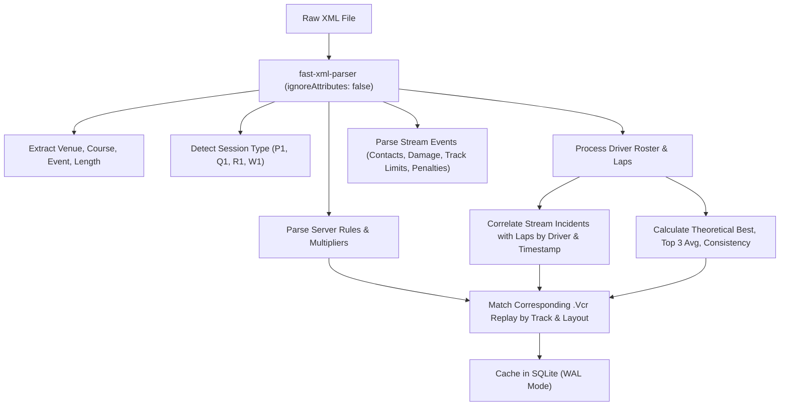

# Le Mans Ultimate / rFactor 2 Results XML Format Specification & Findings

This document provides a comprehensive technical reference for the session results `.xml` log files generated by **Le Mans Ultimate (LMU)** and the **rFactor 2 (rF2 / gMotor)** simulation engine. It details the full XML schema, node hierarchies, attribute encodings, and data types currently parsed by the application, as well as untapped data structures available for future extraction.

---

## 1. File Container & Root Hierarchy

Session result logs are written by the simulation upon session completion to:
```
UserData/Log/Results/YYYY_MM_DD_HH_MM_SS-XX[PQR]\d+.xml
```

### 1.1 Root Document Schema
```xml
<?xml version="1.0" encoding="utf-8"?>
<rFactorXML version="1.0">
  <RaceResults>
    <!-- 1. Global Session & Environment Metadata -->
    <Setting>Race Weekend</Setting>
    <ServerName>Official WEC Server #1</ServerName>
    <GameVersion>1.3</GameVersion>
    <DateTime>1779987170</DateTime>
    <TimeString>2026/05/28 12:52:50</TimeString>
    <TrackVenue>Autodromo Nazionale Monza</TrackVenue>
    <TrackCourse>Monza Curva Grande Circuit</TrackCourse>
    <TrackEvent>6 Hours of Monza</TrackEvent>
    <TrackLength>5793.0</TrackLength>
    
    <!-- 2. Session Type Container (Practice1 / Qualify / Race / Warmup) -->
    <Race>
      <DateTime>1779987194</DateTime>
      <TimeString>2026/05/28 12:53:14</TimeString>
      <Laps>25</Laps>
      <Minutes>60</Minutes>
      <FormationAndStart>1</FormationAndStart>
      
      <!-- 3. Driver Records -->
      <Driver> ... </Driver>
      <Driver> ... </Driver>
      
      <!-- 4. Live Event Stream -->
      <Stream>
        <Incident et="15.8"> ... </Incident>
        <Sector et="120.8"> ... </Sector>
        <TrackLimits et="52.8"> ... </TrackLimits>
        <Penalty et="37.9"> ... </Penalty>
        <Score et="72.1"> ... </Score>
        <ChatMessage et="376.8"> ... </ChatMessage>
      </Stream>
    </Race>
  </RaceResults>
</rFactorXML>
```

---

## 2. Global Session & Server Configuration (`<RaceResults>`)

The `<RaceResults>` element contains top-level server rules, session definitions, and track identification tags.

### 2.1 Track Identification
| Element | Type | Description | Example |
| :--- | :--- | :--- | :--- |
| `<TrackVenue>` | String | Parent circuit facility name. | `Autodromo Nazionale Monza` |
| `<TrackCourse>` | String | Specific track layout variation name. | `Monza Curva Grande Circuit` |
| `<TrackEvent>` | String | Official event or race title. | `6 Hours of Monza` |
| `<TrackLength>` | Float | Physical centerline circuit length in meters. | `5793.0` |
| `<TrackData>` | String | Absolute filesystem path to the track `.mas` package. | `.../Locations/Monza/1.0/layout.mas` |

> [!IMPORTANT]
> Always check `<TrackCourse>` in addition to `<TrackVenue>`. Layout variations (e.g. *Curva Grande* vs *GP*, *Bahrain Outer* vs *WEC*, *Paul Ricard Short* vs *1A-V2*) share the same `<TrackVenue>` but differ in `<TrackCourse>`.

### 2.2 Server Rules & Multipliers
| Element | Type | Values / Units | Description |
| :--- | :--- | :--- | :--- |
| `<Setting>` | String | `Race Weekend`, `Multiplayer`, `Quick Race` | Game mode setting. |
| `<ServerName>` | String | Text | Host/server name for online multiplayer events. |
| `<DamageMult>` | Integer | `0`–`100` (%) | Vehicle damage scaling factor (`50` = 50% damage). |
| `<FuelMult>` | Integer | `1`, `2`, `3`, `5` (Multiplier) | Fuel rate consumption multiplier (`1` = 1x). |
| `<TireMult>` | Integer | `1`, `2`, `3`, `5` (Multiplier) | Tire degradation multiplier. |
| `<TireWarmers>` | Boolean | `0` or `1` | Whether starting tires are pre-warmed. |
| `<FixedSetups>` | Boolean | `0` or `1` | Forces all drivers to use default baseline car setups. |
| `<FixedUpgrades>` | Boolean | `0` or `1` | Disallows custom aerodynamic/engine upgrades. |
| `<ParcFerme>` | Integer | `0` to `3` | Parc Fermé restrictions between Qualifying & Race. |
| `<MechFailRate>`| Integer | `0` (None), `1` (Normal), `2` (Time-scaled) | Mechanical failure frequency. |
| `<VehiclesAllowed>`| String | Comma-separated list | Vehicle / class eligibility whitelist. |
| `<FreeSettings>` | Integer | Bitmask | Garage adjustability mask during session. |
| `<ClientFuelVisible>`| Integer | `0`–`3` | Whether opposing fuel loads are revealed to clients. |
| `<Dedicated>` | Boolean | `0` or `1` | Dedicated server instance vs local listen server. |

### 2.3 Session Envelope Containers
A session log encapsulates one active session within a dedicated sub-container:
- `<Practice1>`, `<Practice2>`, `<Practice3>`, `<Practice4>`: Free Practice sessions (`P1`, `P2`, etc.)
- `<Qualify>`: Qualifying session (`Q1`)
- `<Warmup>`: Warmup session (`W1`)
- `<Race>`: Official Race session (`R1`)

Container attributes and children:
| Element | Type | Description |
| :--- | :--- | :--- |
| `<DateTime>` | Integer | Unix epoch timestamp in seconds at session commencement. |
| `<TimeString>` | String | Clock time formatted as `YYYY/MM/DD HH:MM:SS`. |
| `<Minutes>` | Integer | Timed session limit in minutes (e.g. `60`). |
| `<RaceLaps>` | Integer | Fixed lap count limit (`0` if timed race). |
| `<FormationAndStart>` | Integer | Start procedure code (`0` = Standing, `1` = Formation + Rolling, `2` = Double File). |
| `<MostLapsCompleted>` | Integer | Highest lap count completed by the overall leader. |

---

## 3. Driver Record Schema (`<Driver>`)

Each vehicle participant is logged in a `<Driver>` block within the session container.

### 3.1 Driver Identifiers & Classification
```xml
<Driver>
  <Name>Samuel Lague</Name>
  <isPlayer>1</isPlayer>
  <CarType>Ferrari 499P</CarType>
  <CarClass>Hypercar</CarClass>
  <CarNumber>50</CarNumber>
  <TeamName>Ferrari AF Corse</TeamName>
  <Category>WEC 2024, Hypercar, Ferrari 499P</Category>
  <VehFile>50_FERRARI499P.VEH</VehFile>
  <VehName>Ferrari 499P #50</VehName>
  <UpgradeCode>08210400 00000000 00000000 00000000</UpgradeCode>
  <Connected>1</Connected>
  <Position>1</Position>
  <ClassPosition>1</ClassPosition>
  <GridPos>3</GridPos>
  <ClassGridPos>3</ClassGridPos>
  <FinishStatus>Finished</FinishStatus>
  <FinishTime>3612.450</FinishTime>
  <BestLapTime>95.2341</BestLapTime>
  <Laps>32</Laps>
  <Pitstops>2</Pitstops>
  <Lap num="1" ...> ... </Lap>
  ...
</Driver>
```

| Field | Type | Description |
| :--- | :--- | :--- |
| `<Name>` | String | Driver name. |
| `<isPlayer>` | Integer | `1` for the local human player; `0` for AI or remote multiplayer drivers. |
| `<CarType>` | String | Vehicle model description (e.g. `Ferrari 499P`, `Porsche 911 GT3 R`). |
| `<CarClass>` | String | Standard WEC class code (`Hypercar`, `LMP2`, `LMGT3`, `GTE`). |
| `<CarNumber>` | String | Vehicle competition race number (e.g. `50`, `83`, `911`). |
| `<TeamName>` | String | Official entrant/team name. |
| `<Category>` | String | Full hierarchy taxonomy (Season, Class, Model). |
| `<Position>` | Integer | Overall finish position (`1` = Overall Winner). |
| `<ClassPosition>` | Integer | Class finish position (`1` = Class Winner). |
| `<GridPos>` | Integer | Starting grid rank across all classes. |
| `<ClassGridPos>` | Integer | Starting grid rank within the car class. |
| `<FinishStatus>` | String | `Finished`, `DNF`, `DQ`, `None`. |
| `<DNFReason>` | String | Explanation if not finishing (`Accident`, `Mechanical`, etc.). |
| `<FinishTime>` | Float | Total elapsed race duration in seconds at checkered flag. |
| `<BestLapTime>` | Float | Official fastest personal lap time in seconds (4 decimal precision). |
| `<Laps>` | Integer | Total count of recorded lap entries. |
| `<Pitstops>` | Integer | Official count of pit lane stops served. |
| `<UpgradeCode>` | String | 32-bit hex configuration mask (aero kits, BoP ballast, restrictor). |
| `<Connected>` | Integer | `1` if driver stayed connected to the finish; `0` if dropped out. |
| `<VehFile>` | String | Internal vehicle definition filename (`.VEH`). |
| `<VehName>` | String | Descriptive livery and slot identifier. |

---

## 4. Lap Telemetry Schema (`<Lap>`)

Each completed or attempted lap by a driver is recorded as a `<Lap>` element with XML attributes and text content.

### 4.1 Attribute Reference
```xml
<Lap num="14" p="1" s1="28.452" s2="40.120" s3="35.912" topspeed="324.50"
     fcompound="0,Medium" rcompound="0,Medium"
     FL="0,Medium" FR="0,Medium" RL="0,Medium" RR="0,Medium"
     twfl="0.942" twfr="0.918" twrl="0.935" twrr="0.920"
     fuel="0.684" fuelUsed="2.85"
     ve="0.820" veUsed="3.15"
     pit="0" et="1428.520">104.484</Lap>
```

| Attribute | Type | Units / Range | Description |
| :--- | :--- | :--- | :--- |
| `#text` (Body) | Float / String | Seconds (`104.484`) or `"--.----"` | Lap time duration. If invalid or incomplete, contains `"--.----"`. |
| `@_num` | Integer | `1`..$N$ | 1-indexed sequential lap number. |
| `@_p` | Integer | `1`..$M$ | Running race position when crossing the timing line. |
| `@_s1` | Float | Seconds | Sector 1 split time. |
| `@_s2` | Float | Seconds | Sector 2 split time. |
| `@_s3` | Float | Seconds | Sector 3 split time. |
| `@_topspeed` | Float | km/h | Peak trap speed recorded during this lap. |
| `@_fcompound` | String | Compound Name | Front axle tire compound (e.g. `0,Soft`, `0,Medium`, `Wet`). |
| `@_rcompound` | String | Compound Name | Rear axle tire compound. |
| `@_FL`, `@_FR`, `@_RL`, `@_RR` | String | Compound Name | Individual tire compound mounted on each wheel corner. |
| `@_twfl`, `@_twfr`, `@_twrl`, `@_twrr` | Float | `0.000`–`1.000` | Remaining tire tread fraction per corner (`1.000` = 100%, `0.000` = 0%). |
| `@_fuel` | Float | `0.000`–`1.000` | Fuel tank level fraction remaining at lap completion. |
| `@_fuelUsed` | Float | Liters / kg | Quantity of fuel consumed during this lap. |
| `@_ve` | Float | `0.000`–`1.000` | Virtual Energy (VE) stint budget fraction remaining (BoP rule). |
| `@_veUsed` | Float | MegaJoules / % | Virtual Energy consumed during this lap. |
| `@_pit` | Integer | `0` or `1` | In-lap pit flag: `1` indicates the vehicle entered the pit lane. |
| `@_et` | Float | Seconds | Session elapsed time at lap completion (`"--.---"` if incomplete). |

---

## 5. Live Event Stream Container (`<Stream>`)

The `<Stream>` container chronological logs discrete on-track events with an `@_et` (elapsed time in session seconds) timestamp.

### 5.1 Collisions & Contacts (`<Incident>`)
```xml
<Incident et="158.4">Samuel Lague(0) reported contact (1250.40) with another vehicle Ferrari 499P #51(1)</Incident>
<Incident et="340.2">John Doe(2) reported contact (4820.10) with Immovable</Incident>
```
- **Driver**: Extracted from prefix before `(#)` slot identifier.
- **Force**: Impact magnitude in Newtons (N) inside `([0-9.]+)`.
- **Target**: `another vehicle <name>` indicates car-to-car contact; `Immovable`, `Armco`, or barrier names indicate wall impact.

### 5.2 Mechanical & Bodywork Damage (`<Sector>`)
```xml
<Sector et="210.6">Samuel Lague(0) reports new front wing damage</Sector>
<Sector et="845.2">Alex Smith(3) reports new suspension damage</Sector>
```
- Logs newly sustained component degradation: front wing, rear wing, suspension, puncture, or engine overheating.

### 5.3 Track Limits Violations (`<TrackLimits>`)
```xml
<TrackLimits et="92.4" Driver="Samuel Lague" ID="0" Lap="1"
             WarningPoints="0.25" CurrentPoints="0.50" Resolution="1">
  Warning
</TrackLimits>
```
- `@_Driver`: Infringing driver name.
- `@_Lap`: 0-indexed lap number where violation occurred.
- `@_WarningPoints`: Incremental penalty points assessed for this infraction.
- `@_CurrentPoints`: Cumulative penalty points accumulated in the session.
- `#text`: Stewarding disposition (`Warning`, `Drive Through`, `No Further Action`).

### 5.4 Penalties Awarded (`<Penalty>`)
```xml
<Penalty et="37.9" Driver="Samuel Lague" ID="0" Penalty="Stop/Go" Time="10" Laps="0" Reason="Speeding In Pitlane">
  Samuel Lague received Stop/Go penalty, 10s, 0laps for Speeding In Pitlane. Result: penalties=1, 1st=Stop/Go,10s
</Penalty>
```
- `@_Penalty`: Penalty classification (`Stop/Go`, `Drive Thru`, `Post-Race Time`, `Disqualified`).
- `@_Time`: Stop/Go servicing duration in seconds (e.g. `10`).
- `@_Laps`: Window of laps granted to serve the penalty.
- `@_Reason`: Infraction reason (`Speeding In Pitlane`, `Track Limits`, `False Start`).

### 5.5 Intermediate Timing Loops (`<Score>`)
```xml
<Score et="72.1">Claudio Schiavoni(6) lap=0 point=1 t=-1.000 et=72.060</Score>
<Score et="108.5">Takeshi Kimura(5) lap=0 point=2 t=-1.000 et=108.477</Score>
```
- Tracks physical loop transponder crossings (`point=1` for Sector 1, `point=2` for Sector 2, `point=3` for Finish Line).

### 5.6 In-Game Chat Log (`<ChatMessage>`)
```xml
<ChatMessage et="376.8">J D Breze: Slowing to pit</ChatMessage>
<ChatMessage et="729.4">Race Director: Full Course Yellow</ChatMessage>
```
- Transcribes player and administrative server chat broadcast events.

---

## 6. Current Parser Implementation

The application's parser is implemented in [`server/parser.ts`](file:///c:/Users/Samuel/Documents/LMULapTime/server/parser.ts) using `fast-xml-parser`.

### 6.1 Parsing Pipeline


### 6.2 Key Derived Metrics
1. **Out-Lap Identification**: Automatically flags any lap immediately succeeding a pit in-lap as an out-lap (`isOutLap = true`), excluding it from clean flying averages.
2. **Lap Time Inference**: For laps missing `#text` body times due to track limits or session termination, the parser reconstructs elapsed lap times from $S1 + S2 + S3$ or delta elapsed times ($\Delta et$), keeping leaderboards clean while retaining telemetry data.
3. **Pit Loss Calculation**: Computes time lost in pit lane relative to the driver's clean reference lap time.
4. **Virtual Energy & Fuel Burn Averages**: Calculates clean-lap consumption rates and projected stint lengths in laps.
5. **Layout-Specific Replay Correlation**: Passes both `trackVenue` and `trackCourse` to [`matchesTrack`](file:///c:/Users/Samuel/Documents/LMULapTime/src/utils/paceCategory.ts) to match only the corresponding `.Vcr` file without cross-layout leakage.

---

## 7. Untapped Data & Future Extraction Opportunities

The following high-value data structures exist in LMU XML files and can be extracted to further enrich the application:

### 7.1 Driving Aids & Real Driver Control (`<ControlAndAids>`)
```xml
<ControlAndAids startLap="1" endLap="17">
  PlayerControl,TC=2,ABS=2,Stability=2,AutoShift=3,Clutch,AutoLift,AutoBlip
</ControlAndAids>
<ControlAndAids startLap="18" endLap="18">
  AIControl
</ControlAndAids>
```
- **Assists Transparency**: Extract per-lap Traction Control level, ABS level, Stability Control, Auto-Shift, Auto-Clutch, Auto-Lift, and Auto-Blip.
- **Fair Leaderboards**: Display "Raw" (no assists) vs "Assisted" badges on lap times.
- **AI Handover Detection**: Automatically distinguish laps driven by the player from laps where AI control took over during pit stops or pauses.

### 7.2 Multi-Driver Endurance Stints & Driver Swaps (`<Swap>`)
```xml
<Swap startLap="1" endLap="15">Antares Au</Swap>
<Swap startLap="16" endLap="35">Nicky Catsburg</Swap>
<Swap startLap="36" endLap="50">Samuel Lague</Swap>
```
- **Endurance Stint Breakdown**: Separate laps in endurance team entries by individual driver stints.
- **Driver vs Driver Comparison**: Compare teammate pace, tire wear degradation, and fuel efficiency within the exact same car across different stints.

### 7.3 Vehicle Aerodynamic Kit, Engine Spec & BoP Ballast (`<UpgradeCode>`)
```xml
<UpgradeCode>08210400 00000000 00000000 00000000</UpgradeCode>
```
- The 32-character hex bitmask contains exact vehicle configuration:
  - **Downforce Package**: Le Mans low-drag kit vs high-downforce sprint kit.
  - **Balance of Performance (BoP)**: Ballast weight in kilograms and engine intake restrictor percentages.
- Enables filtering benchmark laps by specific aerodynamic configuration.

### 7.4 Micro-Sector Timing Loops (`<Score>`)
```xml
<Score et="72.060">Samuel Lague(0) lap=1 point=1 t=28.450 et=72.060</Score>
<Score et="112.180">Samuel Lague(0) lap=1 point=2 t=68.570 et=112.180</Score>
```
- Real-time transponder loop timestamps enable high-resolution split tracking and sector-by-sector time delta curves without waiting for full lap completion.

### 7.5 Connection Stability & Disconnect Tracking (`<Connected>`, `<LapRankIncludingDiscos>`)
```xml
<Connected>0</Connected>
<LapRankIncludingDiscos>14</LapRankIncludingDiscos>
```
- Distinguishes mechanical/accident DNFs from network disconnection dropouts.
- Provides true overall rank preservation for endurance events.

### 7.6 Formation Lap & Start Type Telemetry (`<FormationAndStart>`)
```xml
<FormationAndStart>1</FormationAndStart>
```
- Code `0`: Standing start.
- Code `1`: Formation lap + rolling start.
- Allows Lap 1 delta comparisons to separate standing-start acceleration phases from flying rolling starts.

### 7.7 In-Game Event Chat Log (`<ChatMessage>`)
```xml
<ChatMessage et="376.8">Race Director: Full Course Yellow - Speed Limit 80 km/h</ChatMessage>
```
- Provides a chronological transcript of Race Director notifications and team communications, helping contextualize sudden lap time spikes during Full Course Yellow (FCY) or Safety Car periods.
